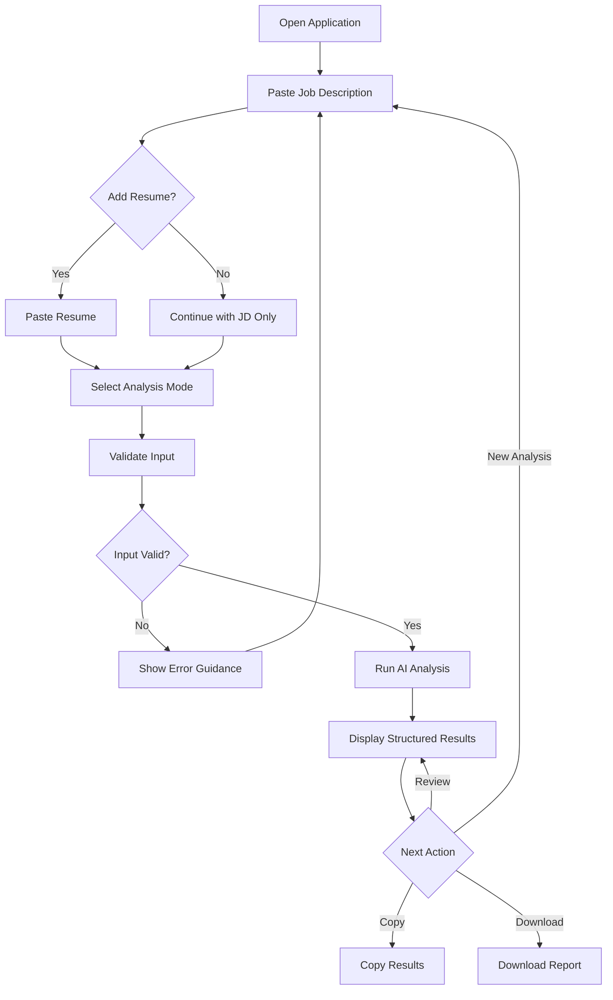
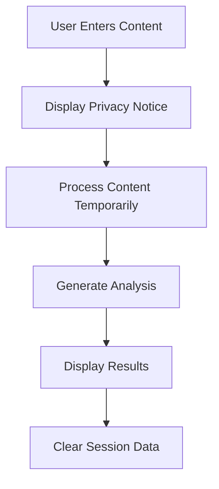

# User Flow

## AI Job Insight Assistant

| Item | Details |
|---|---|
| Version | MVP 1.0 |
| Owner | ZHANG JIN |
| Related Document | [Product Requirements Document](./PRD.md) |

## 1. User Flow Objective

The product should help users move from an unstructured job description to a structured and actionable analysis with minimal learning effort.

The primary flow follows five principles:

- No account is required for the MVP
- Users can start with only a job description
- Resume input is optional
- AI results must include supporting evidence
- Users can review and export the final report

## 2. Primary User Flow

## 3. Analysis Modes

| Mode | Required Input | Main Output |
|---|---|---|
| JD Analysis | Job description | Responsibilities, qualifications, skills, and business keywords |
| Resume Matching | JD and resume | Evidence mapping, match level, and capability gaps |
| Interview Preparation | JD and resume | Behavioral, business, and resume deep-dive questions |
| Role Comparison | Multiple JDs | Differences in responsibilities, requirements, and preparation difficulty |

Role Comparison will be introduced after the MVP.

## 4. Detailed Flow

### Step 1: Enter Job Description

The user pastes a job description into the JD input area.

The interface displays:

- Character count
- Clear input button
- Example JD button
- Privacy reminder

The Analyze button remains disabled when the JD field is empty.

### Step 2: Add Resume

The user may paste resume content into the optional resume input area.

If no resume is provided:

- JD Analysis remains available
- Resume Matching is disabled
- Interview Preparation provides general role questions only

If a resume is provided:

- All MVP analysis modes become available
- The system maps job requirements to resume evidence

### Step 3: Select Analysis Mode

The user selects one of the following:

1. JD Analysis
2. Resume Matching
3. Interview Preparation

The default selection is JD Analysis.

### Step 4: Validate Input

Before sending content to the AI model, the system checks:

- Whether a JD has been provided
- Whether the input is long enough to contain meaningful information
- Whether the selected mode requires a resume
- Whether the input exceeds the supported length
- Whether the content contains obvious sensitive information

### Step 5: Run AI Analysis

After validation, the system:

1. Cleans the text
2. Sends a structured prompt to the AI model
3. Requests JSON-formatted output
4. Validates the returned structure
5. Converts the result into readable sections

A loading state informs the user that the analysis is in progress.

### Step 6: Review Results

Results are displayed in the following order:

1. Position Overview
2. Core Responsibilities
3. Required Qualifications
4. Preferred Qualifications
5. Business and Skill Keywords
6. Resume Evidence Mapping
7. Capability Gap Analysis
8. Interview Preparation
9. Recommended Next Actions

### Step 7: Export Results

The user can:

- Copy one section
- Copy the complete analysis
- Download a Markdown report
- Start a new analysis

## 5. Screen Structure

### Screen 1: Input

| Area | Content |
|---|---|
| Header | Product name and short explanation |
| JD Input | Required job description field |
| Resume Input | Optional resume field |
| Mode Selection | JD analysis, matching, or interview preparation |
| Primary Action | Analyze |
| Supporting Information | Privacy and AI verification notice |

### Screen 2: Analysis State

| Element | Purpose |
|---|---|
| Progress Indicator | Shows that analysis is running |
| Status Message | Explains the current processing stage |
| Cancel Action | Allows the user to stop the request |

### Screen 3: Results

| Area | Content |
|---|---|
| Overview | Company, position, and role category |
| Requirement Analysis | Responsibilities and qualifications |
| Match Analysis | Resume evidence and match levels |
| Gap Analysis | Missing evidence and improvement actions |
| Interview Preparation | Role-specific questions |
| Export Area | Copy and download actions |

## 6. Match Status

The product uses three match categories:

| Status | Definition |
|---|---|
| Strong Match | The resume contains direct and specific evidence |
| Partial Match | Related experience exists but evidence is incomplete |
| Capability Gap | No relevant evidence is found in the resume |

A match status must always include an explanation. The product must not generate unsupported resume evidence.

## 7. Error and Edge Cases

| Situation | System Response |
|---|---|
| Empty JD | Ask the user to paste a job description |
| Very short JD | Explain that more information is required |
| Resume required but missing | Disable the mode and explain why |
| Excessively long input | Ask the user to shorten the content |
| Invalid AI response | Retry once and display a clear error if unsuccessful |
| API unavailable | Preserve the input and allow the user to retry |
| Sensitive personal information | Display a privacy reminder |
| Unsupported output structure | Use a safe fallback result format |

## 8. Privacy Flow

The MVP will not store job descriptions or resume content by default.

## 9. Acceptance Criteria

The user flow is considered complete when:

- A user can complete JD Analysis without entering a resume
- Resume Matching cannot run without resume content
- All validation errors provide a clear next action
- Every match result contains supporting resume evidence
- Users can copy or download the analysis
- Users can begin another analysis without refreshing the application
- Failed AI requests do not erase user input

## 10. Future Flow Improvements

Future versions may support:

- PDF and DOCX resume upload
- Multiple job comparison
- Application tracking
- Saved analysis history
- Personalized skill development plans
- Mobile-optimized interactions
